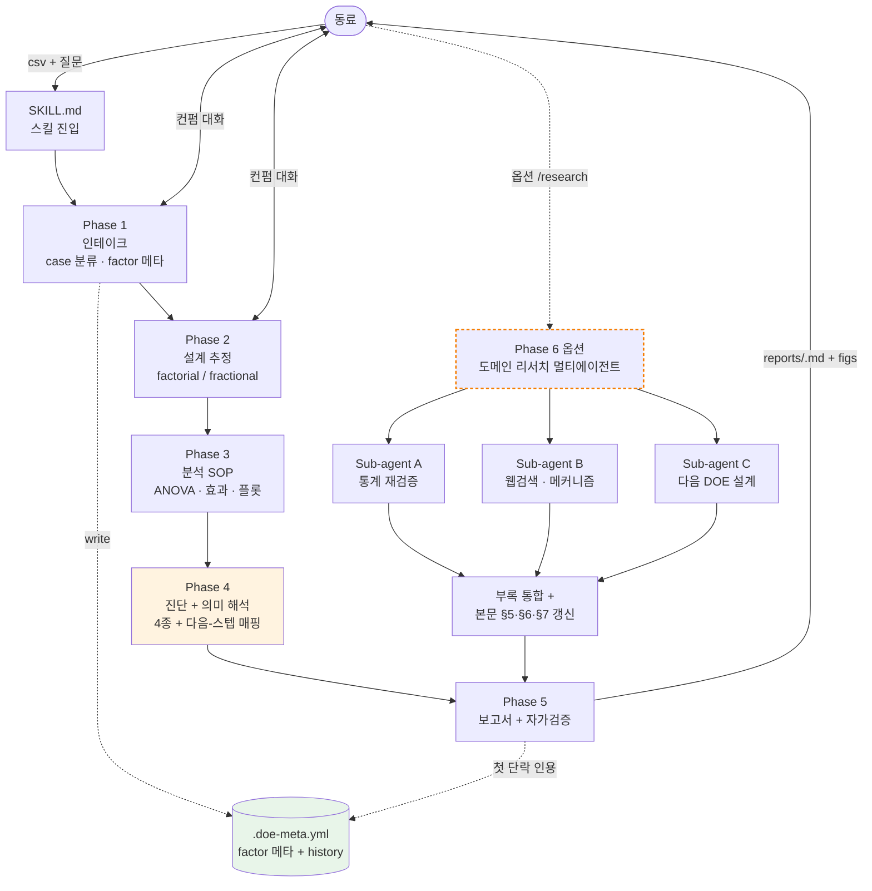
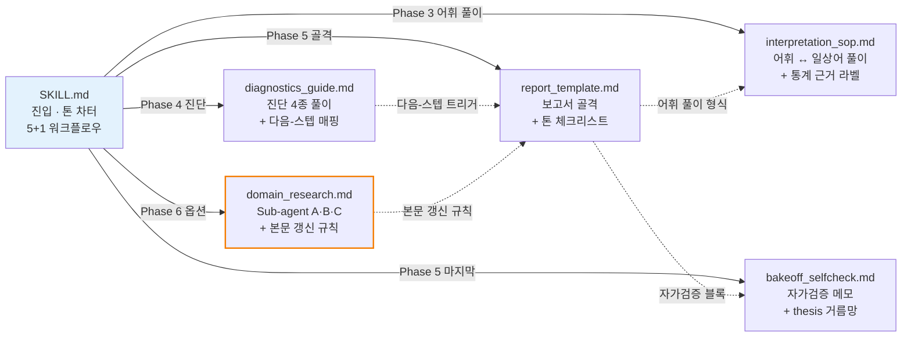

# doe-assistant

비전문 동료(공정 엔지니어 등)가 DOE(Design of Experiments) 결과 csv를 분석할 때, *조용히 빠지는 것들*을 어시스턴트가 같이 챙겨주는 스킬 하네스. Claude Code 우선, Codex 포팅은 thesis 검증 후 결정.

## 한 줄 요약

> 동료가 자기 공정·재료 판단에 *집중*할 수 있도록, 통계적 챙김(진단·해석·다음 스텝)을 어시스턴트가 옆에서 같이 보는 도구.

핵심: **가드레일이 있어 분석에 집중할 수 있다.**

---

## 왜 만드는가 — 취지

DOE 분석은 *조용히 빠지는 항목*이 많은 도메인이다. 비전문 동료가 ChatGPT에 *"이 실험 결과 분석해줘"* 한 줄을 던질 때 자주 빠지는 것들:

- **필수 진단 누락** — 잔차 정규성·등분산·곡률 검정 같은 보조 점검이 빠진 채로 결론이 신뢰됨
- **일반론적 해석** — *"유의함"* 으로 끝나고 어느 변수가 얼마나 dominant인지, 곡선 반응이 있는지 정량 분해 안 됨
- **메타데이터 휘발** — factor 이름·단위·수준 같은 실험 컨텍스트가 매 세션마다 사라짐
- **단정형 다음 스텝** — *"X 하세요"* 한 줄, 대안 시나리오·도메인 메커니즘 가설 없음

빠뜨린 사실을 동료는 *모르기 때문에* 잘못된 결론을 신뢰한다. 이게 silent error다.

이 도구는 강제 게이트로 *차단*하는 대신, **동행 해설하는 어시스턴트**로 위 4개를 *챙기는* 형태로 작동한다. 동료는 자기 공정·재료 판단에 집중하고, 통계적 챙김은 도구가 옆에서 같이 본다.

---

## 무엇을 하는가 — 핵심 가치

가장 큰 가치는 **"가드레일이 있어 분석에 집중할 수 있다"** 는 것이다.

- ChatGPT는 *시키면* 다 할 수 있다. 하지만 *시키지 않으면* 빠뜨린다.
- 동료가 매번 *"진단 했어?"*, *"η² 적어줘"*, *"이전 분석 어땠지?"* 를 직접 챙기면 분석 본질에서 멀어진다.
- 이 스킬은 *시키지 않아도 빠뜨리지 않는 reminder 시스템*. 진단 4종은 자동, 통계 어휘는 일상어 풀이와 함께, 이전 분석은 첫 단락에서 인용.

> **결과**: 동료는 도메인 판단에만 집중할 수 있다.
> *통계적 챙김은 어시스턴트가, 도메인 의사결정은 동료가.*

차별화 축은 다음 4개로 구성된다:

1. **통계 어휘 → 일상어 풀이 + 통계 근거 라벨** 함께 박힘. 어휘는 빼지 않는다 — 보고서가 의사결정 자료와 근거 자료 두 역할을 동시에 하도록.
2. **이전 분석 컨텍스트 영속** (`.doe-meta.yml`) — 매 보고서 첫 단락에서 인용해 라운드 간 인과 사슬 보존.
3. **진단 결과의 *의미* 해석** — 차단 게이트가 아닌 결론 어조 조절. 진단이 약하면 결론을 *차단하지 않고 보수화*한다.
4. **도메인 리서치 멀티에이전트 (옵션)** — 새 공정·새 재료에서 *"새 도메인 시각이 필요할 때"* 동료가 트리거. Sub-agent A(통계 재검증) + B(웹검색·메커니즘·인용) + C(다음 DOE 설계 비교) 병렬 실행 후 보고서 부록 통합.

---

## 무엇을 안 하는가

거절도 가치다. 이 도구는 일반 분석엔 들어가지 않는다.

- 자유 EDA, *"데이터에 뭐 있나 봐줘"* 류 → "Claude.ai 채팅이 더 빠르실 거예요" 한 줄로 redirect
- 일반 trend·결측치·summary stat → 같은 안내
- 일반 regression, time series → 같은 안내

이렇게 좁혀야 thesis가 흐려지지 않는다. 이기려 들지 말 것.

---

## 남아있는 의문 (정직하게)

> **그런데 ChatGPT도 잘 하는데, 이게 정말 실효성이 있는가?**

이 의문은 솔직히 아직 해소되지 않았다.

- 모델 자체는 같은 천장(Claude / GPT). 같은 csv를 같은 모델에 던지면 모델의 분석 능력 자체는 비슷하다.
- 차이가 만들어진다면 *프롬프트·컨텍스트·자동 챙김·도메인 리서치 통합*에서 만들어진다고 가정하는 중.
- 이 가정이 진짜인지는 **bake-off**(공개 DOE 데이터셋으로 ChatGPT vs 하네스 채점)로 측정해야 답이 나온다. 결과에 따라 thesis 유지·축소·폐기 결정.

세 개의 검증 가능한 가설이 박혀있다:

1. *"비전문 동료의 단순 프롬프트로는 ChatGPT가 4종 진단을 자주 빠뜨린다"* → bake-off 채점 항목 1
2. *"같은 프로젝트의 라운드 간 컨텍스트는 ChatGPT 채팅에서 휘발한다"* → 다회차 시뮬레이션으로 검증
3. *"동료는 도메인 판단에 집중할 수 있을 때 더 좋은 결정을 내린다"* → 동료 사용자 테스트(*"ChatGPT 대신 쓸 의향"* 70%↑)로 검증

세 가설 모두 *측정 가능한 형태*로 박혔다. 만약 셋 다 약하게 나오면 — 이 프로젝트는 정직하게 멈춘다. 자랑이 목적이 아니다.

---

## 빌드 단계 (현재 위치)

| Step | 내용 | 통과 기준 | 상태 |
|---|---|---|---|
| 1 | 동료 1-2명에게 "최근 6개월 DOE 빈도" 인터뷰 | 월 1회 이상 | ⬜ 미실행 |
| 2 | Bake-off 채점 (공개 데이터셋 3-5개) | ChatGPT 평균 4/10 이하 | ⬜ 미실행 |
| 3 | factorial PoC 단일 스킬 구축 | reference 결과와 수치 일치 | 🟡 v0.2 골격 작성 완료 |
| 4 | 동료 사용자 테스트 5건 | "ChatGPT 대신 쓸 의향" 70% 이상 | ⬜ 미실행 |
| 5 | 확장 (RSM 등) 또는 thesis 재검토 | — | ⬜ |

각 단계에 *통과 기준*이 박혀있는 게 핵심이다. 이전 시도가 흐려진 가장 큰 이유는 통과 기준 부재였다.

**현재 가장 큰 리스크**: Step 1 동료 인터뷰가 미실행. *"동료가 실제로 DOE를 월 1회 이상 하는가?"* 가 NO면 thesis 자체를 재검토해야 한다.

---

## 폴더 구조

```
doe-assistant/
├── README.md                        # 이 문서
├── CLAUDE.md                        # 빌드 작업 지침
├── calm-crunching-kitten.md         # 핸드오프 (모든 설계 결정의 출발점)
└── doe-assistant.skill/             # 산출물
    ├── SKILL.md                     # 메인 스킬 진입점, 톤 차터
    └── references/
        ├── diagnostics_guide.md     # 진단 4종 + 진단별 다음-스텝 매핑
        ├── interpretation_sop.md    # 통계 어휘 ↔ 일상어 풀이 + 근거 라벨
        ├── bakeoff_selfcheck.md     # 매 보고서 자가검증 메모
        ├── domain_research.md       # Sub-agent A·B·C 멀티에이전트
        └── report_template.md       # 보고서 골격
```

---

## 구조 — 호출 흐름과 참조 관계

이 스킬이 실제로 어떻게 동작하는지를 두 측면에서 본다 — *시간순 호출 흐름*(동료 ↔ 어시스턴트 ↔ Phase)과 *정적 파일 참조 관계*(SKILL.md ↔ references).

### 1. 사용자 대화와 Phase 진행 흐름

동료가 csv를 들고 들어오면, 어시스턴트는 5단계 필수 파이프라인을 컨펌 대화 두 번을 끼워 진행하고 보고서를 돌려준다. 옵션 6단계(멀티에이전트)는 동료가 *"새 도메인 시각이 필요하다"* 또는 `/research` 를 트리거할 때만 호출된다.



**이 흐름의 핵심**

- 동료가 직접 입력하는 자리는 두 군데뿐이다 — Phase 1·2의 컨펌, 그리고 옵션 Phase 6 트리거. 나머지는 자동으로 흘러 보고서까지 도달한다.
- `.doe-meta.yml`은 첫 라운드에서 생성되고, 이후 매 보고서가 *첫 단락에서 인용*한다. 라운드 간 인과 사슬을 끊지 않기 위함.
- Phase 4 진단(주황 배경)은 *차단 게이트가 아니라 결론 어조 조절*. 위반이 있어도 결론은 차단되지 않고 보수화된다.
- 옵션 멀티에이전트(점선 테두리)가 호출되면 부록만 만들어지는 게 아니라 *본문 4곳*(헤더 메타·§5·§6·§7)이 한 줄씩 갱신된다 — 본문만 읽는 사람도 핵심을 받게.

### 2. SKILL.md ↔ references 참조 관계

`SKILL.md`는 진입점이자 톤 차터다. 각 Phase에서 어느 reference를 어떻게 부르는지의 정적 그림:



**이 그래프의 핵심**

- `SKILL.md`는 references를 *읽기*만 하고 직접 *지시*하지 않는다 — references는 LLM에게 reminder를 제공하는 출발점이지 강제 SOP가 아니다.
- `interpretation_sop.md`는 가장 많이 참조됨 — Phase 3·5뿐 아니라 진단 풀이(`diagnostics_guide.md`)·보고서 톤(`report_template.md`)에도 배경으로 작동.
- `report_template.md`가 cross-reference 허브 역할 — 어휘 풀이·자가검증·다음-스텝 매핑·부록 갱신 규칙을 모두 호출해 한 보고서로 묶는다.
- `domain_research.md`(주황 강조)는 옵션 모듈이지만 *ChatGPT가 한 채팅창으로 흉내 내기 어려운 차별화 핵심 모듈*.

### 3. 동료 입장에서 받는 산출물

| 산출물 | 언제 생기나 | 내용 |
|---|---|---|
| `.doe-meta.yml` | Phase 1 첫 라운드 + 매 라운드 갱신 | factor 메타 + history(이전 라운드 1줄 요약 누적) |
| `reports/{YYYY-MM-DD}-{exp}.md` | Phase 5 매번 | 본문(이전 인용 → 결과 → 진단 → 결론 → 다음 스텝 → 자가검증) |
| `reports/{...}.figs/*.png` | Phase 3 자동 | Pareto · main effect · interaction · response surface 등 |
| `reports/{...}.appendix.md` | Phase 6 트리거 시만 | 멀티에이전트 결과(Sub-A 재검증 / Sub-B 도메인 리서치 / Sub-C 다음 design) |

본문(`.md`)만 봐도 의사결정 핵심은 받을 수 있고, 부록(`.appendix.md`)은 *깊이*가 필요한 사람이 더 들어가는 layering 구조다.

### 4. 톤 일관성이 어떻게 흘러가나

위 두 차트의 모든 노드에 *동일한 톤 원칙*이 박혀 있다는 점이 이 스킬의 단단함이다.

- **SKILL.md §0** 톤 차터에서 *"풀이가 본체, 어휘는 (통계적 근거: …) 라벨로 함께"* 원칙 선언
- **interpretation_sop.md** 어휘 매핑이 그 형식을 출발점으로 제공
- **diagnostics_guide.md** 진단 4종이 5블록 구조(왜 보는가 / 결과 보는 법 / 공정에서 보면 / 결론 어조 / 통계 근거 라벨)로 같은 톤
- **report_template.md** 보고서 골격이 그 톤을 결합 형식으로 묶음
- **domain_research.md** Sub-agent B 출력도 도메인 풀이가 본체, 인용 출처는 함께
- **bakeoff_selfcheck.md** 자가검증 메모도 *"동료에게 이게 의미하는 것"* 풀이 톤

어느 reference에서도 *"풀이가 본체"* 원칙이 깨지지 않게 — 만약 깨지면 동료 이해도가 떨어지고, 그 손실이 *thesis 거름망(자가검증 메모)*에서 잡히는 폐쇄 회로 구조.

---

## 톤 원칙

이 프로젝트는 **강제 SOP가 아닌 어시스턴트 톤**을 출발점으로 한다.

- SKILL.md·references는 모두 *LLM이 빠뜨릴 만한 것을 reminder하는 도구*로 박혔지, 강제 게이트가 아니다. 자유 추론을 누르면 LLM 성능을 다 못 쓴다는 관찰에서 나온 결정.
- 통계 어휘는 *(통계적 근거: …)* 라벨로 풀이 옆에 두고, 일상어 풀이가 본체. 어휘를 빼지는 않는다 — 보고서는 동료의 의사결정 자료이자 나중의 근거 자료.
- 진단도 *차단형 게이트*가 아니라 *결론 어조 조절* 형태. 약하면 결론을 보수화하되 차단하지 않는다.

자세한 톤 차터는 [`doe-assistant.skill/SKILL.md`](./doe-assistant.skill/SKILL.md) §0 참고.

---

## 도구·기술

- **우선 환경**: Claude Code. Codex CLI 포팅은 Step 4 통과 후 결정.
- **Python 의존**: statsmodels / pingouin 얇게 호출. 강제 SOP 코드는 회피 — LLM이 그때그때 호출하는 형태.
- **데이터 보안**: 외부 업로드 금지 R&D 데이터에서도 작동 (로컬 처리).
- **멀티에이전트**: Claude Code의 Task 도구로 Sub-agent A/B/C 병렬 실행.

---

## 관련 문서

- 핸드오프(설계 결정의 출발점): [`calm-crunching-kitten.md`](./calm-crunching-kitten.md)
- 빌드 지침: [`CLAUDE.md`](./CLAUDE.md)
- 메인 스킬: [`doe-assistant.skill/SKILL.md`](./doe-assistant.skill/SKILL.md)
- thesis 보호 메커니즘: [`doe-assistant.skill/references/bakeoff_selfcheck.md`](./doe-assistant.skill/references/bakeoff_selfcheck.md)
- 차별화 핵심 모듈: [`doe-assistant.skill/references/domain_research.md`](./doe-assistant.skill/references/domain_research.md)

---

## 라이선스

미정. 동료 사용자 테스트(Step 4) 통과 후 결정.
# doe-assistant-skill
